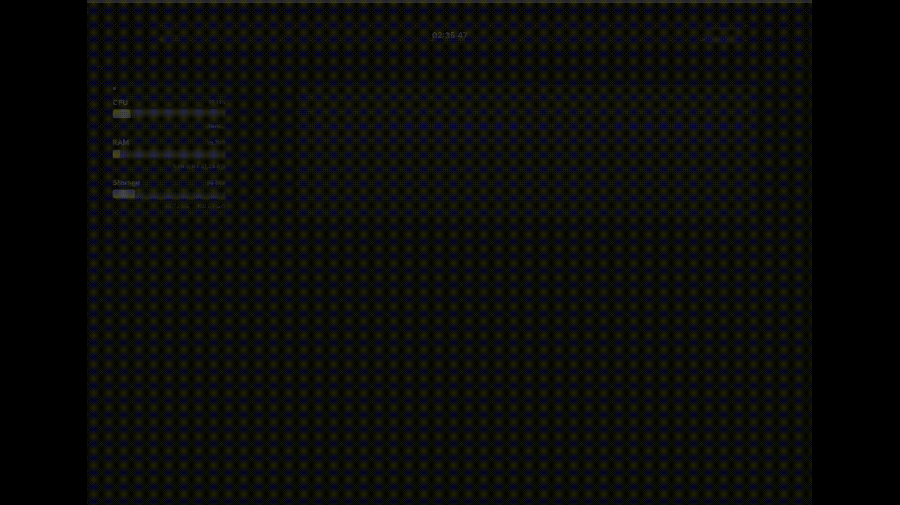

<div align="center" width="100%">
  
</div>
<h1 align="center" width="100%">
    Dumont
</h1>

<p style="text-align:center; font-size: 16px; font-weight: 400" align="center">
    Dumont is an open-source tool designed to simplify the creation and management of Docker containers via a web UI. Ideal for self-hosting, Dumont offers an intuitive interface for handling container-related tasks with ease.
</p>
<p align="center" width="100%">
    <a target="_blank" href="https://hub.docker.com/r/lnardon/dumont"></a>
     <a target="_blank" href="https://hub.docker.com/r/lnardon/dumont"></a> 
</p>

---

  </br>


  </br>

## **Prerequisites**

---

- Docker installed on your server.
  </br>
  </br>

## **Installation**

---

### Using Docker Image (Docker Hub)

1 - Pull the latest image from Docker Hub:

```bash
docker pull lnardon/dumont
```

2 - Run the Dumont container. Replace the placeholder values with your personal information:

```bash
docker run -d -e JWT_SIGNING_KEY="YOURSECRETKEYHERE" -e LOGIN_USERNAME="YOURUSERNAME" -e LOGIN_PASSWORD="YOURPASSWORD" -v /var/run/docker.sock:/var/run/docker.sock -p 3322:3322 lnardon/dumont
```

3 - Access Dumont at http://localhost:3322

</br>

### Build from source

1 - Clone the repository and build the Docker image:

```bash
git clone https://github.com/lnardon/Dumont.git && cd Dumont && docker build -t dumont .
```

2 - Start the container using the following command. Replace the placeholders with your information:

```bash
docker run -d -e JWT_SIGNING_KEY="YOURSECRETKEYHERE" -e LOGIN_USERNAME="YOURUSERNAME" -e LOGIN_PASSWORD="YOURPASSWORD" -v /var/run/docker.sock:/var/run/docker.sock -p 3322:3322 dumont

```

3 - Access Dumont at http://localhost:3322

</br>
</br>
</br>
