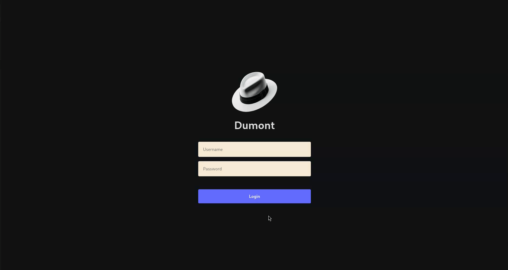

<div align="center" width="100%">
  
</div>
<h1 align="center" width="100%">
    Dumont
</h1>
<p align="center" width="100%">
  <a target="_blank" href="https://hub.docker.com/r/lnardon/dumont"></a>
  <a target="_blank" href="https://hub.docker.com/r/lnardon/dumont"></a> 
</p>

<p style="text-align:start; font-size: 16px; font-weight: 400" align="center">
  Dumont is an open-source tool designed to simplify the creation and management of Docker containers via a web UI. Ideal for self-hosting and for those who want to learn Docker, it offers a pretty and intuitive interface for handling container-related tasks.
</p>

---

  </br>


  </br>

## **Prerequisites**

- Docker Daemon installed
  </br>
  </br>

## **Installation**

## Using Docker Image (Docker Hub)

1 - Pull the latest image from Docker Hub:

```bash
docker pull lnardon/dumont:2.0
```

2 - Use the command below to run the container. Replace the placeholder values with your personal information:

```bash
docker run -d \
    -e JWT_SIGNING_KEY="YOUR_SECRET_KEY" \ # Replace with your own secret key
    -e LOGIN_USERNAME="YOUR_USERNAME" \ # Replace with your own username
    -e LOGIN_PASSWORD="YOUR_PASSWORD" \ # Replace with your own password
    -v /var/run/docker.sock:/var/run/docker.sock \
    -p 3322:3322 lnardon/dumont:2.0
```

3 - Access Dumont at http://localhost:3322

</br>
</br>

## Build from source

1 - Clone the repository and build the Docker image:

```bash
git clone https://github.com/lnardon/Dumont.git && cd Dumont && docker build -t lnardon/dumont .
```

2 - Use the command below to run the container. Replace the placeholder values with your personal information:

```bash
docker run -d \
    -e JWT_SIGNING_KEY="YOUR_SECRET_KEY" \ # Replace with your own secret key
    -e LOGIN_USERNAME="YOUR_USERNAME" \ # Replace with your own username
    -e LOGIN_PASSWORD="YOUR_PASSWORD" \ # Replace with your own password
    -v /var/run/docker.sock:/var/run/docker.sock \
    -p 3322:3322 lnardon/dumont

```

3 - Access Dumont at http://localhost:3322
